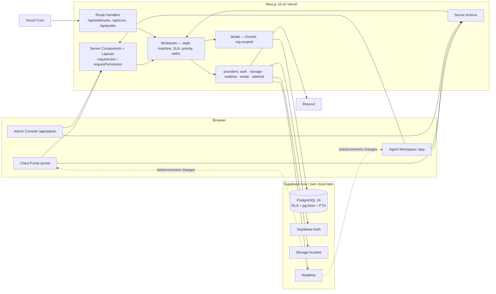
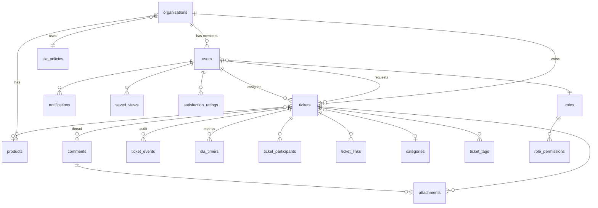

# Architecture — Expendables Client Request Management System

> Companion to [`requirements.md`](./requirements.md), [`design.md`](./design.md) and [`security.md`](./security.md).
> Guiding constraint from the company: **Supabase now, their own cloud Postgres later.** Every decision below is judged against "how hard is that move?"

---

## 1. Stack

| Layer | Choice | Why |
|---|---|---|
| Framework | **Next.js 16** (App Router, React 19, Server Components, Server Actions, `proxy.ts`) | Same major as the public website (16.1.6) so components/tokens can be shared; Node runtime for server code. |
| Language | TypeScript 5.9, `strict` | |
| Styling | **Tailwind CSS 4** + CSS variables from [`design.md`](./design.md) | Same as website. |
| UI primitives | **shadcn/ui on Base UI** (`@base-ui/react`, as the website uses) + `lucide-react` | Accessible primitives, restyled with brand tokens. |
| Motion | `motion` (Framer Motion v12) | Springs, interruptible — required by design.md §5. |
| Forms / validation | `react-hook-form` + **zod** (shared schemas server + client) | Single source of truth for input validation. |
| Data access | **Drizzle ORM** + `postgres` (postgres.js) driver over `DATABASE_URL` | Plain Postgres; migrations are SQL; works identically on Supabase, RDS, Cloud SQL, or a VM. |
| Database | **PostgreSQL 16** (Supabase‑hosted now) | Company preference; RLS; JSONB; `tstzrange`. |
| Auth | **Supabase Auth** via `@supabase/ssr` — *behind `lib/auth/provider.ts` interface* | Fast to ship (magic link, TOTP, password leak check). Interface allows swapping to Auth.js/Keycloak on own cloud. |
| Storage | **Supabase Storage** (private buckets, signed URLs) — *behind `lib/storage/provider.ts`* | S3‑compatible API; swap to S3/GCS/MinIO later by changing the adapter. |
| Realtime | **Supabase Realtime** (Postgres changes) — *behind `lib/realtime/provider.ts`* | Fallback adapter: SSE + polling, for own cloud. |
| Email | **Resend** + React Email templates — *behind `lib/email/provider.ts`* | Branded transactional email; swap to SES/SMTP later. |
| Jobs / scheduling | **pg‑boss** (Postgres‑backed queue) triggered by Vercel Cron (every minute) | No extra infra; lives in the same Postgres; portable. Jobs: SLA ticks, auto‑close, digests, retention. |
| Rate limiting | `@upstash/ratelimit` (Redis) now — *behind `lib/ratelimit/provider.ts`*; Postgres‑backed fallback | |
| Search | Postgres full‑text (`tsvector` + GIN) with `pg_trgm` for keys | No Elasticsearch needed at this scale. |
| Observability | pino (structured logs), Sentry, Vercel Analytics off in portal | |
| Testing | Vitest (unit), Playwright (e2e + authz matrix), `pgTAP` for RLS policies | |
| Tooling | pnpm, ESLint 9 (flat config), Prettier, Husky + lint‑staged, Semgrep, gitleaks | |
| Hosting | Vercel (app) + Supabase (DB/Auth/Storage) → later: company cloud (containers) + managed Postgres | Next.js standalone output (`output: 'standalone'`) keeps the Docker path open. |

### 1.1 Portability rules (non‑negotiable)

1. **No `supabase-js` table queries anywhere.** All reads/writes go through Drizzle in `lib/dal`. Supabase clients are used *only* for Auth, Storage and Realtime — via the provider interfaces.
2. **Migrations are plain SQL** (`drizzle-kit generate` → reviewed `.sql` in `db/migrations`). No Supabase dashboard edits. Supabase‑specific SQL (`auth.*` schema, `storage.*`) is isolated in `db/migrations/supabase/` and excluded from the portable set.
3. **RLS uses session variables** (`current_setting('app.user_id', true)`), not `auth.uid()`, so policies move unchanged.
4. **Identity is our `users` table**, keyed by our UUID. Supabase's `auth.users.id` is stored in `users.auth_provider_id`. Swapping auth = new provider adapter + backfilling that column.
5. **One env var flips the DB**: `DATABASE_URL`. Everything else (`SUPABASE_*`) is provider config.

---

## 2. High‑level view



Request path for a mutation (e.g. "Resolve ticket"):

1. Client component calls Server Action `resolveTicket(input)`.
2. Action: `const ctx = await requireUser()` → `requirePermission(ctx, 'ticket.resolve')` → `ResolveTicketSchema.strict().parse(input)`.
3. Domain: `ticketMachine.transition(ticket, 'resolve', ctx)` validates status/required fields, computes SLA stop, builds events.
4. DAL: single transaction: `SET LOCAL app.user_id…` → update ticket (with `version` check) → insert `ticket_events` → update `sla_timers` → enqueue `notify` job.
5. `revalidatePath`, return typed result; UI already showed the optimistic state.
6. Job worker sends emails via provider; realtime pushes the row change to open clients.

---

## 3. Repository layout

```
expendables-system/
├── app/
│   ├── (auth)/                 login, magic-link, reset, invite/[token], mfa
│   ├── (portal)/portal/        client surface — own layout, own nav
│   │   ├── page.tsx            my requests
│   │   ├── new/                new request (type picker → form)
│   │   └── tickets/[key]/      thread
│   ├── (app)/app/              staff surface — sidebar shell
│   │   ├── page.tsx            dashboard
│   │   ├── tickets/            queues, table, [key]/  (developer: 'My work' + submit sheet; admin: review queue + review sheet)
│   │   ├── clients/            orgs, [id]/
│   │   ├── reports/
│   │   └── admin/              users, roles, orgs, sla, categories, templates, audit, settings
│   ├── api/
│   │   ├── cron/[job]/route.ts     Vercel Cron → pg-boss tick (secret header)
│   │   ├── webhooks/email/route.ts inbound email (P1)
│   │   └── public/v1/…             signed website form (P1), API keys (P2)
│   ├── layout.tsx, error.tsx, not-found.tsx, globals.css
│   └── proxy.ts                routing/redirect only — NO auth decisions
├── components/
│   ├── ui/                     shadcn/Base UI primitives (restyled)
│   ├── shell/                  sidebar, topbar, command-palette, notifications
│   ├── tickets/                table, row, badges, thread, composer, properties-panel, work-log, submit-review-sheet, review-sheet
│   ├── dashboards/             admin, developer, agent, client dashboards (stat tiles, load board, review queue)
│   ├── portal/                 portal-specific composites
│   └── charts/                 report charts (follow dataviz skill)
├── lib/
│   ├── auth/                   provider.ts (interface), supabase.ts (impl), session.ts, require.ts
│   ├── authz/                  permissions.ts (role → permission set), policy.ts (can(ctx, action, resource))
│   ├── dal/                    tickets.ts, comments.ts, orgs.ts, users.ts, sla.ts, audit.ts … (Drizzle, org-scoped)
│   ├── domain/                 ticket-machine.ts, priority.ts, sla-calendar.ts, sla-timers.ts, keys.ts
│   ├── actions/                Server Actions grouped by entity (thin: auth → validate → domain → dal)
│   ├── schemas/                zod schemas per entity and per role
│   ├── storage/ email/ realtime/ ratelimit/   provider interfaces + implementations
│   ├── jobs/                   pg-boss workers: sla-tick, auto-close, notify, digest, retention
│   ├── design/                 motion.ts, status.ts (colour/icon maps)
│   ├── errors.ts, env.ts, logger.ts, utils.ts
├── db/
│   ├── schema/                 Drizzle schema (one file per table group)
│   ├── migrations/             portable SQL
│   ├── migrations/supabase/    Supabase-only SQL (auth hooks, storage policies)
│   ├── policies/               RLS policies (SQL) + pgTAP tests
│   └── seed/                   roles, permissions, categories, default SLA, demo data (dev only)
├── emails/                     React Email templates
├── tests/
│   ├── unit/                   domain logic
│   ├── authz/                  role × entity × action matrix
│   └── e2e/                    Playwright golden paths, IDOR checks
├── public/brand/               copied from ../brand-assets
├── docs/                       this folder
└── .claude/skills/apple-design/
```

Boundaries enforced by ESLint `no-restricted-imports`:
- `app/(portal)/**` may import `lib/actions/portal/*` and `lib/dal/portal/*` only.
- `components/**` may not import `lib/dal/**` or any provider.
- Only `lib/dal/**` may import `db/**`.

---

## 4. Data model

### 4.1 ER diagram



### 4.2 Core tables (portable SQL sketch)

```sql
create type org_type      as enum ('staff','client');
create type org_tier      as enum ('standard','priority','enterprise');
create type ticket_type   as enum ('incident','service_request','change_request','question','project_enquiry');
create type ticket_status as enum ('new','open','in_progress','in_review','pending_client','on_hold','resolved','closed','cancelled');
create type work_state    as enum ('investigating','fix_in_progress','fix_ready','blocked','needs_info');
create type review_outcome as enum ('approved','returned');
create type level3        as enum ('low','medium','high');
create type priority      as enum ('p1','p2','p3','p4');
create type hold_reason   as enum ('awaiting_vendor','awaiting_change_window','awaiting_approval','awaiting_third_party','other');
create type resolution_code as enum ('fixed','workaround','configuration','user_education','not_reproducible','duplicate','wont_fix','cancelled_by_client','no_response');
create type visibility    as enum ('public','internal');
create type ticket_source as enum ('portal','agent','email','website_form','api');

create table organisations (
  id            uuid primary key default gen_random_uuid(),
  type          org_type not null,
  name          text not null,
  slug          text not null unique,
  tier          org_tier not null default 'standard',
  timezone      text not null default 'Asia/Colombo',
  sla_policy_id uuid references sla_policies(id),
  auto_close_days int not null default 4 check (auto_close_days between 1 and 28),
  status        text not null default 'active',
  created_at    timestamptz not null default now(),
  updated_at    timestamptz not null default now(),
  deleted_at    timestamptz
);

create table roles (id text primary key, org_type org_type not null, label text not null);
create table permissions (id text primary key, description text);
create table role_permissions (role_id text references roles, permission_id text references permissions, primary key (role_id, permission_id));

create table users (
  id               uuid primary key default gen_random_uuid(),
  auth_provider_id text unique,                 -- Supabase auth.users.id today
  org_id           uuid not null references organisations(id),
  role_id          text not null references roles(id),
  email            citext not null unique,
  full_name        text not null,
  phone            text,
  avatar_url       text,
  timezone         text,
  mfa_enrolled     boolean not null default false,
  session_version  int not null default 1,      -- bump to invalidate all sessions
  status           text not null default 'invited',  -- invited | active | deactivated
  notification_prefs jsonb not null default '{}',
  created_at timestamptz not null default now(), updated_at timestamptz not null default now(), deleted_at timestamptz
);

create sequence ticket_key_seq;
create table tickets (
  id              uuid primary key default gen_random_uuid(),
  key             text not null unique default ('EXP-' || nextval('ticket_key_seq')),
  org_id          uuid not null references organisations(id),
  requester_id    uuid not null references users(id),
  assignee_id     uuid references users(id),
  type            ticket_type not null,
  subject         text not null check (char_length(subject) <= 160),
  description     text not null check (char_length(description) <= 20000),
  status          ticket_status not null default 'new',
  hold_reason     hold_reason,
  hold_note       text,
  urgency         level3 not null default 'medium',
  impact          level3 not null default 'medium',
  priority        priority not null,             -- computed in domain layer; trigger re-checks
  priority_overridden boolean not null default false,
  category_id     uuid references categories(id),
  subcategory_id  uuid references categories(id),
  product_id      uuid references products(id),
  source          ticket_source not null,
  resolution_code resolution_code,
  resolution_note text,
  escalation_level int not null default 0,
  escalated_at    timestamptz,
  work_state      work_state,                    -- developer's progress marker while assigned
  time_spent_minutes int not null default 0,     -- maintained from work_logs in the same transaction
  submitted_at timestamptz, submitted_by uuid references users(id),
  reviewed_at  timestamptz, reviewed_by  uuid references users(id), review_outcome review_outcome,
  first_responded_at timestamptz, resolved_at timestamptz, closed_at timestamptz,
  reopened_count  int not null default 0,
  custom_fields   jsonb not null default '{}',
  search_vector   tsvector generated always as (to_tsvector('english', coalesce(subject,'') || ' ' || coalesce(description,''))) stored,
  version         int not null default 1,        -- optimistic concurrency
  created_by uuid not null references users(id), updated_by uuid references users(id),
  created_at timestamptz not null default now(), updated_at timestamptz not null default now(), deleted_at timestamptz,
  check ((status = 'on_hold') = (hold_reason is not null)),
  check (status <> 'in_review' or submitted_at is not null),
  check (status <> 'resolved' or (resolution_code is not null and resolution_note is not null))
);
create index on tickets (org_id, status);
create index on tickets (assignee_id, status);
create index on tickets using gin (search_vector);
create index on tickets using gin (key gin_trgm_ops);

create table comments (
  id uuid primary key default gen_random_uuid(),
  ticket_id uuid not null references tickets(id),
  org_id uuid not null references organisations(id),     -- denormalised for RLS speed
  author_id uuid not null references users(id),
  visibility visibility not null,
  body text not null check (char_length(body) <= 20000),
  body_html text,                                          -- sanitised render cache
  edited_at timestamptz,
  created_at timestamptz not null default now(), deleted_at timestamptz
);

create table attachments (
  id uuid primary key default gen_random_uuid(),
  ticket_id uuid not null references tickets(id),
  comment_id uuid references comments(id),
  org_id uuid not null references organisations(id),
  uploader_id uuid not null references users(id),
  storage_key text not null unique,      -- {org_id}/{ticket_id}/{uuid}
  file_name text not null, mime_type text not null, size_bytes bigint not null check (size_bytes <= 26214400),
  sha256 text not null, scan_status text not null default 'pending',
  created_at timestamptz not null default now(), deleted_at timestamptz
);

create table work_logs (                  -- developer time + findings (internal)
  id uuid primary key default gen_random_uuid(),
  ticket_id uuid not null references tickets(id),
  org_id uuid not null references organisations(id),
  user_id uuid not null references users(id),
  logged_on date not null default current_date,
  minutes int not null check (minutes between 1 and 1440),
  note text not null check (char_length(note) <= 5000),
  work_state work_state,                  -- state the developer set with this entry
  started_at timestamptz, ended_at timestamptz,   -- when the inline timer was used
  created_at timestamptz not null default now(), updated_at timestamptz not null default now(), deleted_at timestamptz
);
create index on work_logs (ticket_id); create index on work_logs (user_id, logged_on);

create table submissions (                -- developer → admin hand-off; one row per submit
  id uuid primary key default gen_random_uuid(),
  ticket_id uuid not null references tickets(id),
  org_id uuid not null references organisations(id),
  developer_id uuid not null references users(id),
  findings text not null, root_cause text, changes_made text not null, verification text not null,
  suggested_resolution_code resolution_code,
  proposed_reply text not null,           -- client-facing draft; admin may edit before sending
  time_minutes int not null,              -- snapshot of tickets.time_spent_minutes at submit
  submitted_at timestamptz not null default now(),
  outcome review_outcome, reviewer_id uuid references users(id), reviewed_at timestamptz,
  review_notes text,                      -- required when returned
  sent_reply text,                        -- what the admin actually sent (diff vs proposed_reply, P1)
  check (outcome is null or reviewer_id is not null)
);
create index on submissions (ticket_id, submitted_at desc);
-- submissions are immutable after review: UPDATE allowed only while outcome is null (enforced by trigger + RLS)

create table ticket_events (              -- append-only audit
  id bigserial primary key,
  ticket_id uuid not null references tickets(id),
  org_id uuid not null,
  actor_id uuid,                          -- null = system
  kind text not null,                     -- created | status_changed | assigned | priority_changed | commented | sla_at_risk | ...
  data jsonb not null default '{}',       -- {from, to, reason, ...}
  ip inet, user_agent text,
  created_at timestamptz not null default now()
);

create table sla_policies (
  id uuid primary key default gen_random_uuid(),
  name text not null,
  calendar jsonb not null,                -- {hours:{mon:[["09:00","17:00"]],...}, holidays:[...], tz:"Asia/Colombo"}
  targets jsonb not null                  -- {p1:{first_response_min:30,resolution_min:240,calendar:'24x7'}, ...}
);
create table sla_timers (
  id uuid primary key default gen_random_uuid(),
  ticket_id uuid not null references tickets(id),
  metric text not null,                   -- first_response | resolution
  target_minutes int not null,
  started_at timestamptz not null,
  paused_at timestamptz,
  elapsed_ms bigint not null default 0,
  due_at timestamptz not null,
  at_risk_notified boolean not null default false,
  breached_at timestamptz,
  met_at timestamptz,
  unique (ticket_id, metric)
);

-- also: categories, products, tags, ticket_tags, ticket_participants(ticket_id,user_id,kind), ticket_links(a,b,kind),
--       org_settings(developers_can_self_assign bool, developer_public_reply 'always'|'after_first_admin_reply'|'never', show_time_to_client bool),
-- canned_responses, saved_views, notifications, satisfaction_ratings, invitations(token_hash, expires_at, used_at),
-- audit_log (non-ticket admin actions), api_keys (P2)
```

### 4.3 Row‑Level Security (portable)

```sql
alter table tickets enable row level security;

-- session context set by the DAL per transaction
-- SET LOCAL app.user_id = '<uuid>'; SET LOCAL app.org_id = '<uuid>'; SET LOCAL app.role = 'agent';

create policy tickets_staff_all on tickets
  for all using (current_setting('app.role', true) in ('agent','lead','admin','system'));   -- developers: see policy below

create policy tickets_client_org on tickets
  for select using (
    current_setting('app.role', true) in ('client_user','client_admin')
    and org_id = current_setting('app.org_id', true)::uuid
    and (
      current_setting('app.role', true) = 'client_admin'
      or requester_id = current_setting('app.user_id', true)::uuid
      or exists (select 1 from ticket_participants p where p.ticket_id = tickets.id and p.user_id = current_setting('app.user_id', true)::uuid)
    )
  );

-- developers: only tickets assigned to them or watched; work_logs/submissions never visible to client roles
create policy tickets_developer on tickets
  for select using (
    current_setting('app.role', true) = 'developer'
    and (assignee_id = current_setting('app.user_id', true)::uuid
         or exists (select 1 from ticket_participants p where p.ticket_id = tickets.id and p.user_id = current_setting('app.user_id', true)::uuid and p.kind = 'watcher'))
  );
create policy work_logs_staff_only on work_logs
  for all using (current_setting('app.role', true) in ('agent','developer','lead','admin','system'));
create policy submissions_staff_only on submissions
  for all using (current_setting('app.role', true) in ('agent','developer','lead','admin','system'));

create policy comments_client_public_only on comments
  for select using (
    current_setting('app.role', true) not in ('client_user','client_admin')
    or (visibility = 'public' and org_id = current_setting('app.org_id', true)::uuid)
  );
```

The app connects as role `app_rw` (no `BYPASSRLS`, no DDL). `ticket_events`/`audit_log`: `GRANT INSERT, SELECT` only. `pgTAP` tests in `db/policies/tests` assert each policy.

---

## 5. Domain logic (pure, tested)

| Module | Responsibility |
|---|---|
| `domain/ticket-machine.ts` | The state chart from requirements §5.2 as data: `transitions[from][action] = {to, roles, requires: ['resolution_code'], effects: ['stop_sla', 'notify_requester']}`. `transition()` returns `{ticket, events, jobs}` or throws `InvalidTransition`. |
| `domain/priority.ts` | `computePriority(impact, urgency)` matrix; override rules. |
| `domain/review.ts` | Submit / approve / return rules (requirements §5.4): required submission fields, who may review, what approving writes (public comment + `resolution_note` + `resolved`), what returning writes (`in_progress`, keep assignee, `review_returned` event). |
| `domain/work-logs.ts` | Validation (minutes bounds, 24 h edit window), ticket total recomputation, timer → minutes. |
| `domain/sla-calendar.ts` | Business‑hours math (`addBusinessMinutes`, `businessMinutesBetween`) with holidays/DST; 24×7 calendar. |
| `domain/sla-timers.ts` | Start/pause/resume/stop/reopen; at‑risk (75 %) and breach detection; pure functions over `sla_timers` rows + `now`. |
| `domain/first-response.ts` | Rule from requirements §5.3. |
| `authz/permissions.ts` | `ROLE_PERMISSIONS: Record<Role, Permission[]>` — e.g. `ticket.read.org`, `ticket.read.own`, `ticket.read.assigned`, `ticket.assign`, `ticket.transition.resolve`, `ticket.submit_review`, `ticket.review`, `worklog.write`, `comment.public`, `comment.internal`, `admin.sla`. `developer` = `ticket.read.assigned, worklog.write, ticket.work_state, ticket.submit_review, ticket.transition.on_hold, comment.internal, comment.public*` (*subject to `org_settings.developer_public_reply`). Generated authz matrix test. |
| `authz/policy.ts` | `can(ctx, permission, resource?)` incl. resource checks (own ticket, same org). |

All domain modules are side‑effect‑free and unit‑tested with Vitest (target ≥ 90 %).

---

## 6. Jobs (pg‑boss)

| Job | Trigger | What |
|---|---|---|
| `sla.tick` | cron every 1 min | For running timers: compute elapsed, mark at‑risk/breach, emit events, enqueue `notify`, bump `escalation_level` on breach. |
| `ticket.auto_close` | cron every 15 min | `resolved` older than org `auto_close_days` → `closed`; reminder at T‑1 day. |
| `ticket.auto_close_pending` (P1) | cron hourly | `pending_client` idle 7 days → reminder d5 → close d7. |
| `notify` | enqueued by actions | Build email from template, send via provider, write `notifications` row; retry ×5 with backoff; dead‑letter to admin. |
| `digest` (P1) | cron 08:00 org‑local | Daily digest emails. |
| `retention` (P1) | cron nightly | Hard‑delete soft‑deleted rows past grace; purge storage. |
| `attachment.scan` (P1) | enqueued on upload | Malware scan → `scan_status`. |

Vercel Cron hits `/api/cron/tick` with `CRON_SECRET`; the handler runs `boss.work()` for ≤ 50 s. On own cloud, run a long‑lived worker container instead — same code.

---

## 7. Auth flow (Supabase now)

```mermaid
sequenceDiagram
  participant B as Browser
  participant N as Next.js (layout/action)
  participant S as Supabase Auth
  participant DB as Postgres
  B->>N: GET /app/tickets (cookie)
  N->>S: getUser() via @supabase/ssr (verifies JWT)
  S-->>N: auth user {id, amr}
  N->>DB: select users where auth_provider_id = id and status='active'
  DB-->>N: user {id, org_id, role_id, session_version, mfa_enrolled}
  N->>N: requireUser(): check session_version, MFA if role requires, build AuthContext
  N->>DB: BEGIN; SET LOCAL app.user_id/org_id/role; query; COMMIT
  N-->>B: render
```

`lib/auth/provider.ts`:

```ts
export interface AuthProvider {
  getSessionUser(): Promise<{ providerId: string; email: string; amr: string[] } | null>;
  signInWithPassword(email: string, password: string): Promise<Result>;
  sendMagicLink(email: string, redirect: string): Promise<void>;
  enrollTotp(): Promise<{ qr: string; secret: string }>;
  verifyTotp(code: string): Promise<boolean>;
  signOut(scope: 'local' | 'global'): Promise<void>;
}
```

Migration later: implement `AuthProvider` with Auth.js (Argon2id credentials + TOTP) or Keycloak; users log in again once; no schema change.

---

## 8. Realtime

- Supabase Realtime "Postgres Changes" on `tickets` and `comments`, filtered by `ticket_id`; RLS decides what each subscriber may see (clients never receive `internal` comments).
- Client hook `useTicketLive(ticketId)` from `lib/realtime/provider.ts`. Fallback implementation: SSE endpoint `/api/tickets/[id]/events` backed by `LISTEN/NOTIFY` — used on own cloud.
- List pages (P1) subscribe to a per‑queue channel and re‑fetch counts.

---

## 9. Environment & config

```
DATABASE_URL=postgres://app_rw:…@…:5432/postgres?sslmode=require   # the only DB pointer
NEXT_PUBLIC_SUPABASE_URL=…
NEXT_PUBLIC_SUPABASE_ANON_KEY=…        # auth only; RLS blocks tables
SUPABASE_SERVICE_ROLE_KEY=…            # server-only: admin auth ops (invite), never for data
STORAGE_BUCKET=attachments
RESEND_API_KEY=…  EMAIL_FROM="EXPENDABLES Support <support@…>"
UPSTASH_REDIS_REST_URL=… UPSTASH_REDIS_REST_TOKEN=…
CRON_SECRET=…  WEBSITE_FORM_HMAC_SECRET=…  APP_ENCRYPTION_KEY=…
SENTRY_DSN=…  APP_URL=https://…
```

`lib/env.ts` validates with zod at import; missing/invalid → build fails.

---

## 10. Migration path to the company's own cloud

| Step | Action | Code change |
|---|---|---|
| 1 | `pg_dump` from Supabase → restore into managed Postgres (RDS/Cloud SQL/Azure) or VM; run portable migrations to verify | none |
| 2 | Point `DATABASE_URL` at new DB; run pg‑boss worker as a container | none |
| 3 | Implement `StorageProvider` for S3/GCS/MinIO; copy objects (`rclone`) keeping `storage_key` | 1 adapter file |
| 4 | Implement `RealtimeProvider` SSE fallback (already planned) | flip provider |
| 5 | Implement `AuthProvider` with Auth.js/Keycloak; migrate users (email + force reset or SSO) | 1 adapter + user comms |
| 6 | Swap Upstash → Postgres/Redis limiter | flip provider |
| 7 | Build Docker image from `output: 'standalone'`; deploy behind their load balancer; TLS; HSTS | Dockerfile |
| 8 | Re‑run ZAP + pgTAP + authz matrix | none |

Estimated code touched: **< 5 % of the codebase**, all in `lib/*/provider` implementations.

---

## 11. Key decisions (ADR summary)

| # | Decision | Alternatives considered | Why |
|---|---|---|---|
| ADR‑01 | Drizzle over Prisma / supabase‑js | Prisma (heavier, own migration engine); supabase‑js (locks in RLS via `auth.uid()`) | SQL‑first, portable, RLS via session vars, tiny runtime |
| ADR‑02 | RLS via session variables, not JWT claims | Supabase‑native RLS | Portable; also lets one DB role serve all requests through a pool |
| ADR‑03 | pg‑boss for jobs | Inngest, Trigger.dev, Supabase Edge cron | Zero extra vendors; moves with the DB |
| ADR‑04 | Statuses as enum + events for escalation/reopen | Extra statuses | Fewer states, cleaner reporting, matches ServiceNow/Zendesk semantics |
| ADR‑05 | Priority computed from impact×urgency | Free choice | Clients pick urgency honestly; staff judge impact; predictable SLA |
| ADR‑06 | Three surfaces in one app | Separate portal app | Shared tokens/components; simpler auth; route‑group boundaries give isolation |
| ADR‑07 | Auth in layouts/actions, `proxy.ts` for redirects only | Middleware auth | Next.js 16 guidance; CVE‑2025‑29927 lesson |
| ADR‑08 | Markdown‑lite comments with `rehype-sanitize` | Rich‑text HTML editor | Smaller XSS surface; good enough for support threads |
| ADR‑09 | Postgres FTS over external search | Meilisearch/Elastic | Scale doesn't justify another service; portable |
| ADR‑10 | `in_review` as a real status + `submissions` table, `work_state` as a sub‑status column | Flags only; separate "dev task" entity linked to the ticket (Jira SM ↔ Jira Software style) | One ticket = one conversation the client and admin both see; review changes *ownership* so it deserves a status; a sub‑status keeps the client‑facing label stable ("Being worked on") while staff get detail |
| ADR‑11 | Time as `work_logs` rows summed into `tickets.time_spent_minutes` in the same transaction | Time on comments; separate timesheet app | Auditable per entry; per‑client monthly export; no double bookkeeping |

---

## 12. Delivery plan (prototype)

| Week | Milestone |
|---|---|
| 1 | Scaffold, tokens, shell (sidebar/topbar), auth (password + magic link + TOTP), users/orgs/roles schema + RLS + authz matrix tests |
| 2 | Tickets: schema, state machine, priority, create (portal + agent), table/queues, detail + thread + composer (public/internal), attachments, **assign to developer, work logs + timer, work_state, submit‑for‑review + review sheet** |
| 3 | SLA policies/calendar/timers + jobs, notifications (email + in‑app), auto‑close, admin console (users, orgs, categories, SLA, templates, audit) |
| 4 | **Four role dashboards** (admin/lead, developer, agent, client), polish pass with `apple-design` skill, performance pass (§13), security pass (headers, CSP, ZAP, Semgrep), e2e golden paths incl. the full delivery loop, seed demo data, hand‑over for testing |

---

## 13. Performance budget (the "performs better" bar)

| Metric | Budget | How |
|---|---|---|
| LCP (dashboard, ticket list, ticket detail) | ≤ 1.5 s on a mid‑range laptop, ≤ 2.5 s on 4G phone (portal) | Server Components render data on the server; streaming with `loading.tsx` skeletons; no client‑side waterfall |
| INP | ≤ 100 ms | Optimistic updates via `useOptimistic`; heavy lists virtualised (`@tanstack/react-virtual`); no layout thrash — animate only `transform`/`opacity` |
| CLS | ≤ 0.05 | `next/font` (no FOIT/FOUT shift); fixed‑size skeletons; images with explicit dimensions |
| JS shipped to the portal | ≤ 150 kB gzipped first load | Route‑group code splitting; `motion` loaded only where used (`LazyMotion` + `m`); no analytics scripts |
| Ticket list query (50k rows, filtered) | p95 ≤ 120 ms | Composite indexes `(org_id,status)`, `(assignee_id,status)`, `(status, updated_at desc)`; keyset pagination (no `OFFSET`); counts via a materialised `queue_counts` view refreshed by the SLA tick |
| Dashboard aggregates | p95 ≤ 200 ms | Pre‑aggregated `daily_ticket_stats` table filled by the nightly job + today computed live |
| Realtime fan‑out | < 500 ms from commit to UI | Postgres changes → Supabase Realtime; per‑ticket channels only |
| Attachment download | Direct from storage via signed URL — never proxied through Next.js | |
| Cold start | Node runtime on Vercel; DB via pooled connection (`postgres` with `max: 1` per lambda + Supabase pooler / PgBouncer) | |

CI runs Lighthouse (`@lhci/cli`) on `/portal`, `/app`, `/app/tickets/[key]` against the preview deployment; budgets above fail the build.
