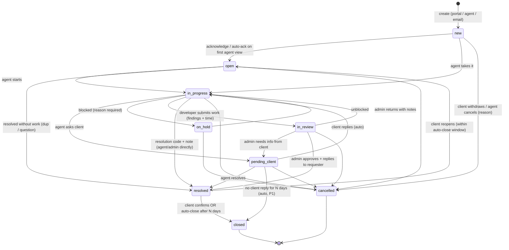
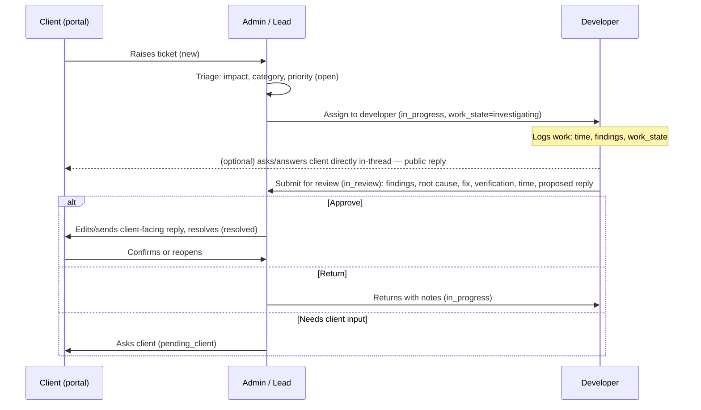

# Requirements — Expendables Client Request Management System

> **Status:** Prototype specification (v0.1, 2026‑09‑12). The prototype will be tested by the
> company, then custom requirements added — so every section marks what is **MVP (P0)**,
> **P1** (right after MVP) or **P2+** (later). Extension points are called out so custom
> requirements can slot in without re‑architecture.
>
> The ticket lifecycle is modelled on how real service desks work — Jira Service Management,
> ServiceNow ITSM and Zendesk — so the company's staff and clients get behaviour they already
> recognise. References are listed in §13.

---

## 1. Purpose & context

EXPENDABLES (PVT) LTD (Gampaha, Sri Lanka) delivers custom software, web/app development, IT consulting and **24/7 technical support & maintenance** to enterprise clients (see [`brand-palette.md` §1](./brand-palette.md)). Today the public website's contact form does not submit anywhere. The company needs a system where:

- **Clients** raise and track requests (incidents, change requests, questions, new‑project enquiries) against the software and services Expendables provides them.
- **Support itself is delivered through the platform**: the admin triages and **assigns tickets to the company's developers**; developers fix, **log time and findings**, update the work state, talk to the client in the thread when needed, and **submit their work to the admin**; the admin **reviews** and **replies to the requester** (§5.4).
- **Admins** manage clients, users, roles, SLAs, categories, and see reports; every party has its own dashboard (§7.8).

### Goals
1. One place for every client request — replaces email/WhatsApp threads.
2. SLA‑driven: first response and resolution targets per priority and client tier, visible to both sides.
3. Clear separation of client‑visible replies vs. internal notes.
4. Secure, multi‑tenant: a client can never see another client's data (see [`security.md`](./security.md)).
5. Looks and feels like the Expendables brand, with a polished "Apple‑grade" interaction quality ([`design.md`](./design.md)).
6. Postgres‑portable: runs on Supabase now, moves to the company's own cloud later without rewrites ([`architecture.md`](./architecture.md)).

### Non‑goals (for the prototype)
- Billing / invoicing.
- Full ITIL Change/Problem management (we do *change requests as a ticket type*, not CAB workflows).
- Knowledge base / self‑service articles (P2).
- Live chat.

---

## 2. Surfaces & roles

The system has **three surfaces** in one Next.js app, gated by role:

| Surface | Route prefix | Who | Purpose |
|---|---|---|---|
| **Client Portal** | `/portal` | Client users | Raise requests, track status, reply, rate resolution |
| **Agent Workspace** | `/app` | Staff (agents, **developers**, leads) | Queues, triage, work tickets, SLAs; developers: *My work*, work logs, submit for review |
| **Admin Console** | `/app/admin` | Admins | Users, clients, roles, SLA policies, categories, templates, audit log, settings — plus the **review queue** and **developer load board** on the admin dashboard |

### 2.1 Roles

Roles are **per membership**: a user belongs to exactly one *organisation* (the Expendables staff org, or a client org) with one role in it. Staff roles and client roles are disjoint.

| Role | Org type | Can |
|---|---|---|
| `client_user` | Client | Create tickets for own org; view/reply to **own** tickets + tickets they are a participant on; rate resolutions; edit own profile |
| `client_admin` | Client | Everything `client_user` can, for **all tickets in their org**; invite/deactivate org contacts; see org SLA policy; cannot see internal notes |
| `agent` | Expendables | Front‑line support. View all tickets; take/assign; change status/priority/category; public replies & internal notes; attachments; canned responses; create tickets on behalf of a client |
| `developer` | Expendables | Engineer who fixes things. Sees tickets **assigned to them** (plus any they are a watcher on); logs **work (time + findings + state)**; internal notes; **public replies to the client in‑thread** (allowed by default, admin can restrict — see §5.4); **submits work for review**; cannot resolve/close, reassign, or change priority |
| `lead` | Expendables | Everything `agent` + assign to developers, reassign anyone, **review submissions** (approve → resolve/reply, or return), escalate, override SLA due dates (logged), bulk actions, manage queues/saved views for team, view reports |
| `admin` | Expendables | Everything `lead` + Admin Console: manage staff & client orgs/users, roles, SLA policies, categories, ticket types, email templates, integrations, audit log, retention. **Step‑up auth required** for destructive/config changes |

| `system` | — | Internal actor for automations (auto‑close, SLA breach events, email ingestion). Never a login. |

> In the company's day‑to‑day flow the **admin** is the dispatcher and reviewer: assigns tickets to developers, reviews what they submit, and replies to the requester. `lead` exists so that responsibility can be delegated later without giving away console rights; in the prototype the admin account simply holds both.

Extension point: roles are data (`roles` + `permissions` tables, seeded), so custom roles (e.g. `read_only_auditor`, `vendor`) can be added without code changes to the authz layer.

---

## 3. Domain model (summary)

| Entity | Notes |
|---|---|
| **Organisation** | Client company *or* the Expendables staff org. Has tier (`standard`/`priority`/`enterprise`), timezone, SLA policy, business hours calendar, status. |
| **User / Profile** | Auth identity + profile (name, email, phone, avatar, timezone, notification prefs). Membership → org + role. |
| **Product / Service** *(P1)* | What the ticket is about: a delivered system or a contracted service, per client org. Lets reports say "12 tickets on Client X's ERP". |
| **Ticket** | The request. Key `EXP‑<n>`. Fields in §4. |
| **Comment** | Thread entry. `visibility = public | internal`. Author, body (markdown‑lite), attachments, edited‑at. |
| **Work log** | A developer's record on a ticket: minutes spent, date, what was done / found, current work state (`investigating`, `fix_in_progress`, `fix_ready`, `blocked`, `needs_info`). Internal only. Sums into `tickets.time_spent_minutes`. |
| **Submission** | The developer's hand‑off to the admin: findings, root cause, fix summary, verification steps, suggested resolution code, proposed client‑facing reply, total time. Creates the `in_review` state. Admin **approves** (→ resolve + reply) or **returns** (→ back to developer with notes). Immutable once decided. |
| **Attachment** | File on private storage, linked to ticket or comment, with uploader, size, MIME, checksum, scan status. |
| **Ticket event** | Immutable audit row for every change (status, assignee, priority, field edits, SLA events, views by staff of sensitive data). |
| **SLA policy** | Per org tier (override per org): targets per priority for *first response* and *resolution*; calendar (24×7 or business hours); pause conditions. |
| **SLA timer** | Per ticket per metric: started, paused, elapsed, due, breached, met. |
| **Category / Subcategory** | Admin‑managed taxonomy (e.g. *Bug*, *Performance*, *Access*, *Data*, *Enhancement*, *Consulting*, *New project*). |
| **Ticket type** | `incident`, `service_request`, `change_request`, `question`, `project_enquiry` (see §4.2). |
| **Tag** | Free labels, staff‑only. |
| **Canned response** | Reusable reply templates with placeholders. |
| **Notification** | In‑app + email delivery record. |
| **Saved view** | Named filter/sort/columns for a user or team. |
| **Link** | Ticket↔ticket relation: `duplicate_of`, `related`, `follow_up_of`, `blocked_by`. |

---

## 4. The ticket

### 4.1 Fields

| Field | Type | Who sets | Required | Notes |
|---|---|---|---|---|
| `key` | `EXP‑1042` | system | — | Sequential, human‑readable; never reused |
| `org_id` | FK | system (from creator) or agent (on‑behalf) | ✔ | Tenant boundary |
| `requester_id` | FK user | creator / agent | ✔ | The client contact who owns the request |
| `type` | enum | client (portal form) or agent | ✔ | §4.2 |
| `subject` | text ≤ 160 | client/agent | ✔ | |
| `description` | markdown ≤ 20k | client/agent | ✔ | Sanitised on render |
| `status` | enum | system + agent (+ client for reopen/cancel) | ✔ | §5 |
| `hold_reason` | enum | agent | when `on_hold` | `awaiting_vendor`, `awaiting_change_window`, `awaiting_approval`, `awaiting_third_party`, `other` (note required) — ServiceNow pattern |
| `urgency` | `low/medium/high` | client picks; agent can change | ✔ | "How fast do you need this?" |
| `impact` | `low/medium/high` | agent | ✔ (default medium) | "How much of the business is affected?" |
| `priority` | `P1..P4` | **computed** from impact × urgency (§4.3); lead may override (logged) | ✔ | Read‑only for clients |
| `category_id` / `subcategory_id` | FK | client (optional) / agent | agent must set before `in_progress` | |
| `product_id` *(P1)* | FK | client/agent | — | |
| `assignee_id` | FK user (staff) | agent/lead/auto‑assign | — | Null = unassigned queue |
| `team_id` *(P1)* | FK | lead | — | Assignment group |
| `participants` | users[] | requester, agent | — | Client‑side CC; they see and can reply |
| `watchers` | users[] | staff | — | Staff following silently |
| `tags` | text[] | staff | — | |
| `source` | enum | system | ✔ | `portal`, `agent`, `email` *(P1)*, `website_form` *(P1)*, `api` *(P2)* |
| `resolution_code` | enum | agent | on `resolved` | `fixed`, `workaround`, `configuration`, `user_education`, `not_reproducible`, `duplicate`, `wont_fix`, `cancelled_by_client` |
| `resolution_note` | markdown | agent | on `resolved` | Shown to client |
| `work_state` | enum | developer | while assigned to a developer | `investigating`, `fix_in_progress`, `fix_ready`, `blocked`, `needs_info` — the developer's own progress marker, shown to admin; client sees only "Being worked on" |
| `time_spent_minutes` | int | **computed** from work logs | — | Shown to staff; optionally to client (org setting, default off) |
| `submitted_at`, `submitted_by`, `reviewed_at`, `reviewed_by`, `review_outcome` | | system | — | Last submission/review; full history in `submissions` |
| `first_responded_at`, `resolved_at`, `closed_at`, `reopened_count`, `escalated_at`, `escalation_level` | timestamps/int | system | — | |
| `custom_fields` *(P1)* | JSONB validated against admin‑defined schema | — | — | Extension point for the client's custom requirements |
| `created_at`, `updated_at`, `created_by`, `updated_by` | | system | | |

### 4.2 Ticket types (Jira "request types" pattern)

Each type has its own **portal form** (field subset + help text) and default SLA behaviour.

| Type | Portal label | When a client uses it | Default urgency options |
|---|---|---|---|
| `incident` | "Something is broken" | Outage, error, degraded performance in a delivered system | low → high (high = production down) |
| `service_request` | "I need something" | Access, data export, environment, configuration, training | low → medium |
| `change_request` | "Change or enhance a feature" | New functionality or modification to delivered software; may lead to a quote | low → medium |
| `question` | "Ask a question" | How‑to, consulting query | low |
| `project_enquiry` | "Start a new project" | Prospective work; maps to the website's "Get a Quote" | — (no SLA resolution target; first‑response only) |

Admins can add types (P1).

### 4.3 Priority matrix (ServiceNow pattern)

Client chooses **urgency**; agent confirms **impact**. Priority is computed and read‑only:

| Impact ↓ / Urgency → | High | Medium | Low |
|---|---|---|---|
| **High** (whole org / production down) | **P1 Critical** | P2 High | P3 Medium |
| **Medium** (a team / degraded) | P2 High | P3 Medium | P4 Low |
| **Low** (one user / cosmetic) | P3 Medium | P4 Low | P4 Low |

Until an agent sets impact, `impact = medium` is assumed so new incidents with urgency *high* land as **P2** and get looked at fast. Leads can override priority with a mandatory reason (audit event).

---

## 5. Ticket lifecycle

### 5.1 Statuses

Synthesised from Jira SM (*Waiting for support / Waiting for customer / Pending / Escalated / Canceled*), ServiceNow (*New → In Progress → On Hold [reason] → Resolved → Closed*) and Zendesk (*New/Open/Pending/On‑hold/Solved/Closed*, auto‑close, no reopen after close).

| Status | Client label | Meaning | SLA clocks |
|---|---|---|---|
| `new` | "Received" | Created, nobody has acknowledged it | first‑response ▶, resolution ▶ |
| `open` | "In queue" | Acknowledged/triaged, waiting for an agent to start (Jira "Waiting for support") | resolution ▶ |
| `in_progress` | "Being worked on" | Agent or **assigned developer** actively working; developer's `work_state` sub‑status visible to staff | resolution ▶ |
| `in_review` | "Being worked on" | Developer **submitted** findings/fix for admin review. Ticket is now owned by the reviewer (admin/lead). Client label unchanged — review is internal | resolution ▶ (still counts; the company owns the delay) |
| `pending_client` | "Waiting for you" | Agent asked the client something; ball is in the client's court (Zendesk "Pending", Jira "Waiting for customer") | resolution ⏸ |
| `on_hold` | "On hold" | Blocked internally — vendor, change window, approval. `hold_reason` mandatory (ServiceNow) | resolution ⏸ (configurable per reason) |
| `resolved` | "Resolved — please confirm" | Agent provided a resolution (`resolution_code` + note required). Client can **reopen** or **confirm** | resolution ✔ stopped |
| `closed` | "Closed" | Final. Locked — no edits/replies. Client raises a **follow‑up ticket** linked to this one instead (Zendesk rule) | — |
| `cancelled` | "Cancelled" | Withdrawn by client or agent with reason; final | stopped, excluded from SLA reporting |

**Escalation** and **reopen** are *flags/events*, not statuses (avoids state explosion):
- `escalated` flag + `escalation_level` (1–3), set by lead or by SLA‑at‑risk automation. Visible as a badge; ticket keeps its working status.
- Reopen: `resolved → open`, `reopened_count++`, resolution clock **restarts from remaining time** (Jira behaviour), requester notified.

### 5.2 Transitions

Rules:
- **Who can transition what**: clients may only `reopen` (resolved→open), `cancel` (their own, before `in_progress`), and *implicitly* move `pending_client → in_progress` by replying. All other transitions are staff.
- `resolved` requires `resolution_code` + `resolution_note`; `on_hold` requires `hold_reason`; `cancelled` requires a reason.
- **Developers** may only: log work, set `work_state`, `in_progress → in_review` (submit), `in_progress → on_hold` (blocked, reason), and comment. They cannot resolve, close, cancel, reassign or change priority — that is the admin's/lead's call after review.
- `in_review` requires a **submission** (findings + fix summary + time). Only `lead`/`admin` may approve or return. Approving resolves the ticket with the reviewer's edited client‑facing reply as the `resolution_note`; returning reverts to `in_progress` with the ticket still assigned to the same developer and a `review_returned` event carrying the notes.
- `closed` and `cancelled` are terminal. A follow‑up creates a new ticket with `follow_up_of` link and copies participants.
- **Auto‑close**: `resolved` → `closed` after **4 days** by default (Zendesk default), admin‑configurable 1–28 days, per org override. A reminder goes to the requester 1 day before.
- **Auto‑close pending** *(P1)*: `pending_client` with no reply after 7 days → reminder at day 5 → `closed` with `resolution_code = no_response`.
- Every transition writes a `ticket_event` and triggers notifications (§8).

### 5.3 First response

`first_responded_at` is set by the **first public comment by staff** (internal notes don't count — a developer's public reply *does* count), or by the first status change to `in_progress`/`pending_client`/`resolved` by staff — whichever comes first. This stops the first‑response SLA clock.

### 5.4 Support delivery workflow: admin → developer → review → client

This is how support is actually delivered through the platform. It mirrors what ServiceNow does with *assignment groups + work notes*, Jira Service Management with *linked Jira Software issues for developers*, and Zendesk with *side conversations* — but in **one ticket**, so nothing is lost between tools.

Rules:

| # | Rule |
|---|---|
| 1 | **Assignment** is by admin/lead (or round‑robin per category, P1). A developer may also *take* an unassigned ticket if the org setting `developers_can_self_assign` is on (default off — the company wants dispatch through the admin). |
| 2 | **Work logs** are the developer's running record. Each entry: date, minutes, note (what was tried / found), `work_state`. Entries are internal, editable by the author for 24 h, then locked; always in the audit trail. |
| 3 | **`work_state`** is the developer's honest progress marker: `investigating` → `fix_in_progress` → `fix_ready`; or `blocked` / `needs_info`. Admin dashboard groups tickets by it. Setting `needs_info` prompts the developer to either ask the client directly or hand back to admin. |
| 4 | **Direct developer ↔ client conversation** happens in the same ticket thread as public replies, so the client sees one continuous conversation and the admin sees everything. Permission `comment.public` is granted to `developer` by default; admin can set a global policy: `always` (default) · `after_first_admin_reply` · `never` (dev writes a draft, admin sends). Client‑facing replies from developers show name + "Engineer, Expendables" — never an internal role label. |
| 5 | **Submission** is a structured form, not a free comment: *Findings*, *Root cause*, *What was changed* (with links/commits), *How it was verified*, *Suggested resolution code*, *Proposed reply to client*, *Time* (auto‑summed, editable with reason). Attachments allowed. Submitting sets `in_review` and notifies reviewers. |
| 6 | **Review** by admin/lead: approve (edits the proposed reply → sent as public comment + `resolution_note`; status → `resolved`; developer notified) · return (notes required; status → `in_progress`; developer notified; `review_returned` event) · ask client (`pending_client`, ticket stays with developer). Review SLA (P1): internal target 4 business hours in `in_review`, shown on the admin dashboard. |
| 7 | **Time** on the ticket = sum of work logs. Visible to staff always; to the client only if the org has `show_time_to_client` (default off). Exportable per client/month for billing (P1). |
| 8 | Everything above is recorded as `ticket_events` (`assigned`, `work_logged`, `work_state_changed`, `submitted`, `review_approved`, `review_returned`). |

---

## 6. SLA

Modelled on Jira SM SLAs (goal per priority, calendar, pause conditions).

| | P1 Critical | P2 High | P3 Medium | P4 Low |
|---|---|---|---|---|
| First response (default tier) | 30 min | 2 h | 8 business h | 1 business day |
| Resolution (default tier) | 4 h | 1 business day | 3 business days | 5 business days |
| Calendar | 24×7 | 24×7 | business hours | business hours |

- Business hours default: **Mon–Fri 09:00–17:00 Asia/Colombo**, with a holiday list; per org override (tier `enterprise` may buy 24×7 on all priorities). Matches the website's "24/7 proactive monitoring, rapid incident response" promise for critical work.
- Clocks pause in `pending_client`; `on_hold` pauses per reason config (default: pause). Clocks stop at `resolved`; restart on reopen with remaining time.
- Thresholds: **at‑risk at 75 %** elapsed (badge turns amber, lead notified), **breached at 100 %** (badge red, escalation level +1, lead + admin notified). Breach is recorded; the timer keeps counting overtime for reporting.
- Client portal shows "Target response by …" / "Target resolution by …" — **not** the percentage/breach language (keeps the tone professional). Staff see the full countdown.
- Leads may extend a due date once per ticket with reason (logged, reported as "adjusted").

Extension point: `sla_policies` are data; adding a metric (e.g. *time to assign*) means adding a row type, not code.

---

## 7. Functional requirements

IDs are stable for traceability. **P0 = prototype scope.**

### 7.1 Authentication & accounts
| ID | Requirement | Pri |
|---|---|---|
| FR‑AUTH‑01 | Email + password login and **magic link** login for all users; passwords ≥ 12 chars, breached‑password check, rate‑limited | P0 |
| FR‑AUTH‑02 | Staff accounts are **invite‑only** (admin creates); client accounts are invite‑only by `client_admin` or Expendables admin. No public self‑signup | P0 |
| FR‑AUTH‑03 | **MFA (TOTP)** mandatory for `admin` and `lead`, optional for others; recovery codes | P0 (admin/lead), P1 (rest) |
| FR‑AUTH‑04 | Invitation links single‑use, expire in 7 days; accepting sets password + MFA (if required) | P0 |
| FR‑AUTH‑05 | Password reset via time‑limited single‑use link; uniform response whether or not email exists | P0 |
| FR‑AUTH‑06 | Sessions: 12 h idle timeout for staff, 30 days remember‑me for clients; "sign out everywhere" | P0 |
| FR‑AUTH‑07 | Step‑up re‑authentication for admin destructive/config actions and for exporting data | P1 |
| FR‑AUTH‑08 | SSO (Google Workspace / Microsoft Entra) for staff | P2 |

### 7.2 Client portal
| ID | Requirement | Pri |
|---|---|---|
| FR‑CP‑01 | "New request" chooses a ticket type; form shows only that type's fields; attachments (≤ 10 files, ≤ 25 MB each, allowed types list); autosave draft | P0 |
| FR‑CP‑02 | Confirmation screen + email with ticket key and expected first‑response target | P0 |
| FR‑CP‑03 | "My requests" list: status, priority (label only), last update, assignee first name; filters (open/resolved/all), search by key/subject | P0 |
| FR‑CP‑04 | `client_admin` sees "All requests in <org>" plus per‑contact filter | P0 |
| FR‑CP‑05 | Ticket thread: public comments only; reply box with attachments; status/target dates panel; **Reopen** button on `resolved`; **Cancel** on `new/open`; **Create follow‑up** on `closed` | P0 |
| FR‑CP‑06 | Add participants (colleagues in same org) to a ticket | P1 |
| FR‑CP‑07 | Satisfaction rating (1–5 + comment) on `resolved`/`closed`, one per ticket, editable 7 days | P1 |
| FR‑CP‑08 | Notification preferences (email on every update / daily digest / none) | P1 |
| FR‑CP‑09 | Mobile‑first layout with bottom‑sheet new‑request flow | P0 |

### 7.3 Agent workspace
| ID | Requirement | Pri |
|---|---|---|
| FR‑AG‑01 | **Queues**: Unassigned, My tickets, All open, At‑risk/Breached, Pending client, On hold, Resolved awaiting close; counts live | P0 |
| FR‑AG‑02 | Ticket table: sortable, filter by status/priority/type/client/assignee/category/tag/SLA state/date; saved views (personal); column chooser; density toggle; keyboard nav (J/K/Enter) | P0 |
| FR‑AG‑03 | Bulk actions on selection: assign, status, priority, tag, merge‑as‑duplicate | P0 (assign/status/priority), P1 (rest) |
| FR‑AG‑04 | Ticket detail: description, thread (public + internal, visually distinct), composer with **Reply to client / Internal note** tabs, attachments, @mention staff, canned responses with placeholders (`{{requester.first_name}}`, `{{ticket.key}}`) | P0 |
| FR‑AG‑05 | Properties panel: status (with required‑field prompts), hold reason, impact/urgency → computed priority, category, assignee (with workload hint), participants/watchers, tags, SLA clocks, links | P0 |
| FR‑AG‑06 | "Take" (assign to me) one‑click; reassign with optional note to new assignee | P0 |
| FR‑AG‑07 | Create ticket on behalf of a client (pick org → contact; or create contact inline) | P0 |
| FR‑AG‑08 | Link tickets (`duplicate_of`, `related`, `follow_up_of`, `blocked_by`); merging duplicates closes the dup with a note and moves participants | P1 |
| FR‑AG‑09 | Global search (⌘K): tickets by key/subject/body, clients, contacts, actions | P0 (tickets/clients), P1 (actions) |
| FR‑AG‑10 | Collision detection: show "Nimal is viewing/replying" on the ticket | P1 |
| FR‑AG‑11 | Time tracking — see FR‑DEV‑02 (moved to P0) | P0 |
| FR‑AG‑12 | Round‑robin auto‑assign per category/team; can be off | P1 |
| FR‑AG‑13 | Presence & realtime updates on list and detail (no manual refresh) | P0 (detail), P1 (list) |

### 7.3a Developer workspace & review (see §5.4)
| ID | Requirement | Pri |
|---|---|---|
| FR‑DEV‑01 | Developer sees **My work** queue: tickets assigned to them grouped by `work_state`, sorted by priority then SLA due; counts; "Blocked" and "Returned from review" surfaced at top | P0 |
| FR‑DEV‑02 | **Work log**: add entry (minutes, date, note, `work_state`) from the ticket; inline timer (start/stop → minutes prefilled); entries listed on the ticket (internal); ticket total auto‑summed; edit own entry ≤ 24 h | P0 |
| FR‑DEV‑03 | Change `work_state` from the properties panel; `blocked`/`needs_info` require a note; admin notified on `blocked` | P0 |
| FR‑DEV‑04 | **Submit for review** sheet with the structured fields of §5.4 rule 5; validation (findings, fix summary, verification, proposed reply required); attachments; sets `in_review` | P0 |
| FR‑DEV‑05 | Developer public replies to the client in‑thread (permission per §5.4 rule 4); composer shows a clear "Visible to client" banner and the client‑facing display name | P0 |
| FR‑DEV‑06 | Developer cannot resolve/close/cancel/reassign/change priority — actions hidden **and** server‑enforced | P0 |
| FR‑DEV‑07 | Admin **Review queue**: tickets in `in_review`, oldest first, with time in review; review sheet shows submission side‑by‑side with the thread; **Approve & reply** (editable reply, resolution code prefilled) / **Return** (notes required) / **Ask client** | P0 |
| FR‑DEV‑08 | Reviewer edits to the proposed reply are kept as a diff on the submission (developer learns what changed) | P1 |
| FR‑DEV‑09 | Internal review SLA (4 business hours) with at‑risk indicator on admin dashboard | P1 |
| FR‑DEV‑10 | Developer self‑assign of unassigned tickets (org setting, default off) | P1 |
| FR‑DEV‑11 | Link commits/PRs/branches on a work log or submission (URL fields; GitHub/GitLab metadata fetch via allowlisted hosts) | P2 |

### 7.4 Client (organisation) management
| ID | Requirement | Pri |
|---|---|---|
| FR‑ORG‑01 | Admin creates/edits orgs: name, tier, timezone, SLA policy, business hours, primary contact, notes, status (active/suspended) | P0 |
| FR‑ORG‑02 | Contacts per org with role (`client_user`/`client_admin`), invite, deactivate; deactivated users lose access immediately | P0 |
| FR‑ORG‑03 | Org page: open tickets, SLA performance, recent activity | P0 |
| FR‑ORG‑04 | Products/services per org | P1 |
| FR‑ORG‑05 | Domain‑based contact matching for email channel | P1 |

### 7.5 Admin console
| ID | Requirement | Pri |
|---|---|---|
| FR‑ADM‑01 | Staff users & roles; invite; deactivate; force MFA reset | P0 |
| FR‑ADM‑02 | Categories/subcategories, ticket types & portal forms, tags, canned responses, resolution/hold reason lists | P0 (categories, canned), P1 (forms) |
| FR‑ADM‑03 | SLA policies & business‑hours calendars & holidays | P0 |
| FR‑ADM‑04 | Email templates (branded, placeholders) with preview | P0 |
| FR‑ADM‑05 | Auto‑close settings (days), auto‑pending‑close (days) | P0 |
| FR‑ADM‑06 | Audit log viewer: who did what, when, from where; filters; export CSV | P0 |
| FR‑ADM‑07 | Data retention settings; export org data; delete org (soft, then hard after 30 days) | P1 |
| FR‑ADM‑08 | Branding: logo, accent colour, portal welcome text | P2 |
| FR‑ADM‑09 | Automation rules (when/if/then) | P2 |

### 7.6 Channels
| ID | Requirement | Pri |
|---|---|---|
| FR‑CH‑01 | Portal (web) | P0 |
| FR‑CH‑02 | Agent‑created | P0 |
| FR‑CH‑03 | **Website contact form → ticket** of type `project_enquiry` via signed API endpoint (fixes the current dead form) | P1 |
| FR‑CH‑04 | Inbound email → ticket / reply (parse, dedupe by `In‑Reply‑To`, attach files, unknown sender → held for review) | P1 |
| FR‑CH‑05 | Public REST API with per‑org API keys | P2 |

### 7.7 Notifications
| ID | Requirement | Pri |
|---|---|---|
| FR‑NT‑01 | Email to requester/participants on: created, public reply, status change, resolved (with rating link), reopened, auto‑close reminder, closed | P0 |
| FR‑NT‑02 | Email to assignee on: assigned, client replied, @mentioned, SLA at‑risk/breached; to leads on breach/escalation | P0 |
| FR‑NT‑03 | In‑app notification centre (bell) with unread count, mark read | P0 |
| FR‑NT‑04 | Reply‑by‑email (secure reply token in address) | P1 |
| FR‑NT‑05 | Daily digest option; quiet hours | P1 |
| FR‑NT‑06 | Slack/Teams webhook for breaches | P2 |

### 7.8 Reporting
| ID | Requirement | Pri |
|---|---|---|
Every party lands on a dashboard built for **their** job. Same component kit, different questions answered.

| ID | Requirement | Pri |
|---|---|---|
| FR‑RP‑01 | **Admin / lead dashboard** (`/app`): tiles — open, unassigned, **awaiting review**, at‑risk, breached today, avg first response, avg resolution (7/30 d); created vs resolved trend; **developer load board** (per dev: assigned, by `work_state`, blocked count, hours logged this week); review queue preview; SLA attainment per client; recent escalations | P0 |
| FR‑RP‑02 | **Developer dashboard** (`/app` for role `developer`): My work by `work_state`; due‑soon list (SLA); returned‑from‑review; blocked; hours logged today/this week with a week sparkline; last 5 client replies awaiting me | P0 |
| FR‑RP‑03 | **Agent dashboard**: unassigned queue, my tickets, pending‑client aging, at‑risk, today's first‑response performance | P0 |
| FR‑RP‑04 | **Client dashboard** (`/portal`): open requests with status + next target date; awaiting‑your‑reply (highlighted); recently resolved (confirm/reopen CTA); monthly summary for `client_admin` (created/resolved, avg resolution, SLA met %, hours logged if enabled); "New request" always one tap away | P0 |
| FR‑RP‑05 | Per‑agent/developer load & resolution; per‑client volume & SLA attainment; per‑category breakdown; time logged per client per month (billing export) | P1 |
| FR‑RP‑06 | CSAT trend | P1 |
| FR‑RP‑07 | CSV export of any table view | P1 |

### 7.9 Audit & compliance
| ID | Requirement | Pri |
|---|---|---|
| FR‑AU‑01 | Immutable event log for every create/update/delete on tickets, comments, attachments, users, orgs, settings; includes actor, IP, user‑agent, before/after diff | P0 |
| FR‑AU‑02 | Staff views of a ticket are recorded (lightweight) for collision detection & access review | P1 |
| FR‑AU‑03 | Soft delete everywhere; hard delete only by admin via retention job | P0 |

---

## 8. Notification matrix (P0)

| Event | Requester | Participants | Assignee | Lead | Admin |
|---|---|---|---|---|---|
| Ticket created | ✔ (confirmation) | ✔ | ✔ if auto‑assigned; else unassigned queue | P1 only | — |
| Staff public reply | ✔ | ✔ | — | — | — |
| Client reply | — | ✔ (others) | ✔ | — | — |
| Internal note / @mention | — | — | mentioned | mentioned | — |
| Status → pending_client | ✔ | ✔ | — | — | — |
| Status → resolved | ✔ (+ rate link) | ✔ | — | — | — |
| Reopened | — | — | ✔ | — | — |
| Auto‑close reminder (T‑1 day) | ✔ | — | — | — | — |
| Closed | ✔ | ✔ | — | — | — |
| Assigned / reassigned | — | — | ✔ | — | — |
| Developer set `blocked` / `needs_info` | — | — | — | ✔ | ✔ |
| Submitted for review | — | — | — | ✔ | ✔ |
| Review approved / returned | — | — | ✔ (developer) | — | — |
| SLA at‑risk (75 %) | — | — | ✔ | ✔ | — |
| SLA breached / escalated | — | — | ✔ | ✔ | ✔ (P1 only) |

Emails are branded (navy header with wordmark), plain‑text alternative, no sensitive content beyond subject + a snippet; deep link requires login.

---

## 9. Non‑functional requirements

| Area | Requirement |
|---|---|
| **Security** | See [`security.md`](./security.md) — OWASP Top 10:2025 controls are **P0**, not optional. Tenant isolation enforced at app layer **and** Postgres RLS. |
| **Performance** | p95 server response < 400 ms for list/detail with 50k tickets; list renders < 1 s on a mid‑range laptop; optimistic UI for all ticket mutations; images/attachments served via signed URLs, never through the Next.js server. |
| **Availability** | Target 99.5 % for prototype (Vercel + Supabase); daily automated DB backups with 30‑day retention; documented restore. |
| **Scalability** | Designed for 100 client orgs / 1k users / 100k tickets without schema change. |
| **Accessibility** | WCAG 2.2 AA; full keyboard operation; screen‑reader labels; reduced‑motion/transparency/contrast honoured ([`design.md` §9](./design.md)). |
| **Browser support** | Last 2 versions of Chrome, Edge, Safari, Firefox; iOS Safari & Android Chrome for the portal. |
| **Localisation** | English only for prototype; all strings in a messages file; dates/times shown in the viewer's timezone with org timezone on hover; Sri Lanka (Asia/Colombo) default. |
| **Data portability** | Plain Postgres schema + SQL migrations; no Supabase‑only SQL in business tables; exports in CSV/JSON. |
| **Observability** | Structured logs (pino), error tracking (Sentry), SLA/automation job metrics, uptime check. |
| **Privacy** | Minimal PII (name, email, phone); retention policy; delete/export per org; no analytics trackers in the portal. |
| **Maintainability** | TypeScript strict; zod at every boundary; ≥ 80 % coverage on domain logic (state machine, SLA, authz); e2e for the 5 golden paths. |

---

## 10. Golden paths (must work end‑to‑end in the prototype)

1. **Client raises an incident** → receives confirmation → agent takes it → asks a question (`pending_client`) → client replies → agent resolves → client confirms → closed. SLA clocks and notifications correct throughout.
2. **Agent creates a ticket on behalf of a client**, assigns to a colleague, colleague adds internal note + public reply; client sees only the public reply.
3. **P1 breach**: incident with urgency high, impact high → P1 → no response in 30 min → at‑risk (22 min) → breached → escalated → lead notified → resolved with overtime recorded.
4. **Client admin** invites a colleague, who logs in via magic link, sees the org's tickets, cannot see another org's ticket by URL (403, logged).
5. **Admin** changes auto‑close to 2 days, adds a category, edits an email template, views the audit log showing all three.
6. **Full support delivery loop**: client raises a bug → admin triages and **assigns to a developer** → developer logs two work entries (timer + manual), sets `fix_in_progress`, asks the client a question **directly in the thread** (client sees it, replies) → developer **submits for review** with findings/fix/verification/proposed reply → admin **returns** it once with notes → developer updates and resubmits → admin **approves**, edits the reply, ticket resolves, client gets the reply and confirms. Time total, all events and both dashboards (developer + admin) reflect each step; the client never sees work logs, the submission or internal notes.

---

## 11. Acceptance criteria conventions

Each FR gets Gherkin scenarios in `tests/e2e` named `FR-XX-NN.spec.ts`. A requirement is "done" when: unit tests for domain logic pass, e2e for the golden path passes, authz test proves cross‑tenant denial, and the screen matches [`design.md`](./design.md) (reviewed with the `apple-design` skill checklist).

---

## 12. Open questions for the company (answer after prototype)

1. Do clients get **per‑product** SLAs or per‑org? (Prototype: per‑org tier.)
2. Should `project_enquiry` tickets live here or only be forwarded to sales email? (Prototype: live here, no resolution SLA.)
3. Public holidays list for Sri Lanka — provide or use a library?
4. Is a CSAT survey wanted, and is it visible to the client admin?
5. Which mailbox becomes the email‑in address (`support@…`)? The website currently shows two spellings of the Gmail address — confirm the correct one.
6. Should logged time be shown to clients by default, and is a monthly time export per client needed for billing? (Prototype: hidden from clients, export P1.)
9. Developer → client direct replies: `always` (prototype default), or only after the admin's first reply?
7. Retention: how long to keep closed tickets and attachments?
8. Branding: will the client portal be white‑labelled per client (P2)?

---

## 13. References (vendor behaviour this spec follows)

- Zendesk — ticket lifecycle & statuses, "Solved auto‑closes after 4 days (max 28), closed tickets can't be reopened; create a follow‑up": <https://support.zendesk.com/hc/en-us/articles/8263915942938-About-the-ticket-lifecycle-and-ticket-statuses>, <https://support.zendesk.com/hc/en-us/articles/4408883475354-Why-do-solved-tickets-change-to-a-closed-status>, <https://support.zendesk.com/hc/en-us/articles/4408894213018-About-system-ticket-rules>
- Jira Service Management — default statuses (*Open, Reopened, Pending, Work in progress, Waiting for customer, Waiting for support, Escalated, Done, Canceled*), request types, customer‑friendly status names on the portal: <https://support.atlassian.com/jira-cloud-administration/docs/default-configurations-for-jira-service-management/>, <https://support.atlassian.com/jira-service-management-cloud/docs/customize-the-workflow-statuses-for-a-request-type/>
- ServiceNow ITSM — incident states (*New → In Progress → On Hold (reason mandatory) → Resolved → Closed*, Canceled), Impact × Urgency → Priority matrix, work notes vs. additional comments: <https://www.servicenow.com/community/itsm-articles/servicenow-incident-workflow-how-incident-management-really-runs/ta-p/3469448>, <https://www.servicenow.com/community/sysadmin-forum/priority-matrix-breakdown/m-p/2590926>
- OWASP Top 10:2025: <https://owasp.org/Top10/2025/0x00_2025-Introduction/>
